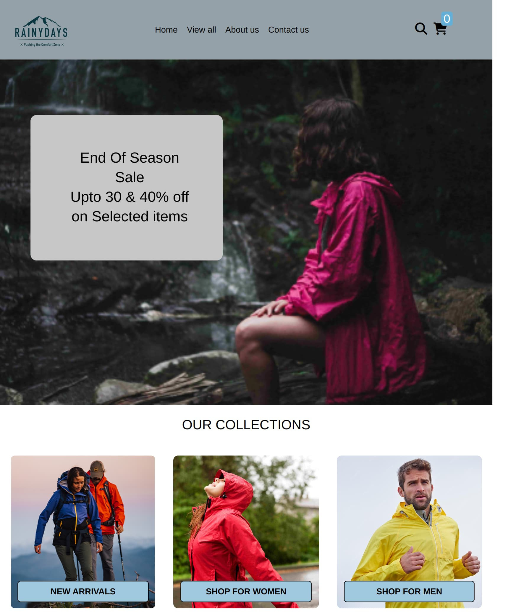

# 🌧️ RainyDays

RainyDays is a responsive e-commerce website for a jacket company. It allows users to browse and view jacket details with a clean and simple layout.

## 🔗 Live Demo
[View Website](https://shamia702.github.io/Javascript-CA/)

## 📂 GitHub Repository
[RainyDays Repo](https://github.com/Shamia702/Javascript-CA)

## 🛠️ Built With
- HTML
- CSS
- JavaScript (Vanilla)

## 📌 Features
- Mobile-first design
- Product listing and details page
- Simple and clear navigation

## 🧠 Reflection
This was my first JavaScript project. I learned how to fetch products from an API and how to dynamically update HTML. If I were to improve this now, I would enhance the UX  with better error handling and loading states.
